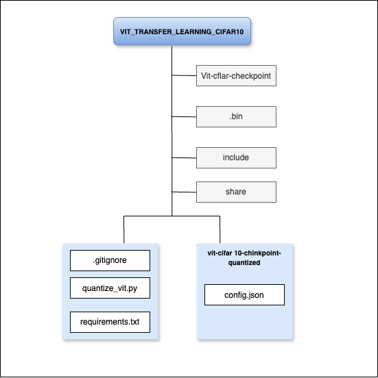

# Vision Transformer Transfer Learning on CIFAR-10 (with Quantization)

This project demonstrates the application of transfer learning using a pre-trained Vision Transformer (ViT) model on the CIFAR-10 dataset. The goal is to fine-tune the ViT model for image classification and reduce its final model size through post-training quantization.

## Project Objectives

- Implement Vision Transformer fine-tuning on the CIFAR-10 dataset
- Save the trained model using `safetensors` for improved safety and efficiency
- Apply dynamic quantization using PyTorch to reduce model size
- Validate that model performance is retained after quantization
- Save the quantized model for efficient deployment (`.pt` format)

## Dataset

**CIFAR-10** is a standard image classification dataset with 10 object classes and 60,000 color images (32x32 pixels).

## Model Details

- **Base Model**: `google/vit-base-patch16-224`
- **Framework**: Hugging Face Transformers + PyTorch
- **Training**: Fine-tuned on CIFAR-10 (10 classes)
- **Quantization**: Dynamic quantization using PyTorch’s `quantize_dynamic`

## Project Architecture

The following diagram summarizes the structural flow and key directories within this repository:

This layout helps clarify:
- Which scripts handle quantization
- Where checkpoints and configs reside
- Output flow of the quantized model
